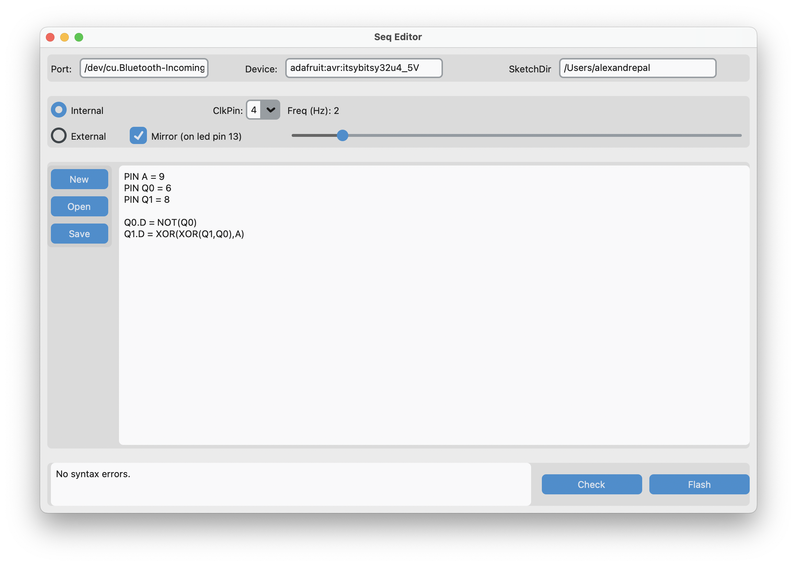

# SeqEditor

SeqEditor is a CustomTkinter-based GUI that lets you write simple sequential/combinational logic in a `.seq` DSL and flash it to an ATmega32u4 board (e.g., Adafruit ItsyBitsy 32u4 5V) using Arduino CLI.

## Features
- Define pins and logic equations in a simple `.seq` syntax
- Built-in syntax + semantic checker
- Internal/external clock configuration
- Generates Arduino `.ino`, compiles, and uploads via `arduino-cli`
- Portable Windows build via PyInstaller

## Requirements
- Windows or macOS
- Arduino CLI installed and on PATH
- Adafruit 32u4 USB driver (Windows)
- `isrClock.h` placed in your SketchDir

## `.seq` Syntax
### Pin definitions
- PIN &lt;name&gt; = &lt;number&gt; where &lt;name&gt; starts with a letter, can have digits and the '_'
- Examples:  
pin Y=8  
PIN A_3 = 9  
PIN Q0 = 6  
### Combinational logic
- Standard logic using NOT, AND, OR and XOR
- Examples:  
Y = AND(A, NOT(Q1))
### Sequential logic (D flip-flop input)
- Registered variables use &lt;name&gt; starting with a Q
- Examples:  
Q0.D = NOT(Q0)  
Q1.D = XOR(Q0, A)  

## Screenshot


## Running from source
```bash
pip install customtkinter
python seq_editor.py


